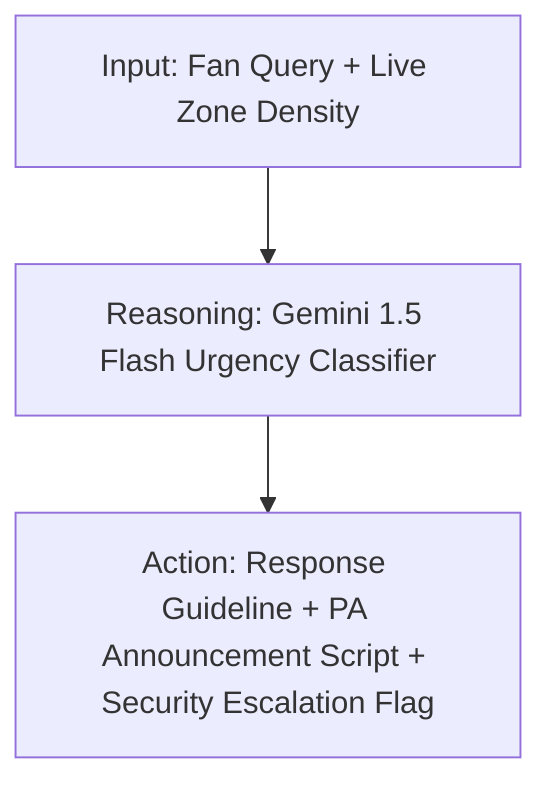

# ArenaIQ 🏟️ — FIFA World Cup 2026™ Mission Control & Volunteer Co-Pilot

ArenaIQ is an enterprise-grade, Generative AI-enabled platform designed for FIFA World Cup 2026™ stadium operations. Developed for the Hack2Skill PromptWars Challenge 4, ArenaIQ addresses critical matchday challenges: crowd bottlenecks, multilingual communication gaps, real-time staff/volunteer coordination, and step-free accessibility.

By combining **deterministic pathfinding algorithms** with **advanced LLM reasoning** (Gemini 1.5 Flash) and **real-time synchronization** (Supabase Realtime), ArenaIQ acts as a mission control for operators and a real-time co-pilot for stadium volunteers.

---

## 🎯 Primary Persona: The Stadium Volunteer
A stadium volunteer managing a zone of **4,000+ international fans** speaking dozens of languages needs immediate, actionable answers. A fan approaches in distress. Is it a minor convenience or a medical emergency? 

ArenaIQ implements the **Input → Reasoning → Action** design pattern to empower this volunteer in real time:



### The Operational Feedback Loop

| Stage | Input / Telemetry | AI Reasoning Process | Output & Action |
| :--- | :--- | :--- | :--- |
| **INPUT** | Volunteer captures fan query + real-time stadium zone occupancy telemetry. | Language, context, and physical crowd density context are aggregated. | Real-time state updates in volunteer UI. |
| **REASONING** | Security context check. | Gemini detects urgency level (`LOW`, `MEDIUM`, `HIGH`, `CRITICAL`), translation needs, and safety escalations. | Secure API gateway processing (`/api/gemini`). |
| **ACTION** | Machine-readable JSON output. | Generates: (1) friendly verbal response, (2) megaphone-ready PA announcement, (3) instant dispatch toggle (`escalate: true/false`). | Rendered in high-contrast cards. |

---

## 🗺️ Smart Navigation: Decoupling Routing from GenAI
To guarantee safety, **Gemini is never allowed to invent paths**. A routing hallucination during a stadium evacuation could be catastrophic. ArenaIQ separates routing calculation from natural language explanations:

1. **Deterministic Pathfinding**: A custom Dijkstra solver (`src/lib/routing.ts`) calculates the shortest path over actual stadium graph data. It applies a 3× weight penalty to crowded zones and skips closed/blocked zones entirely.
2. **Wheelchair / Step-Free Mode**: If wheelchair routing is toggled, the Dijkstra engine filters out any graph edge marked as non-step-free (e.g. stairs), forcing a route through elevators and ramps, or returning an accessibility alert if no safe path exists.
3. **Explainable AI (XAI)**: The computed nodes are packaged into a structured payload and sent to the secure server-side `/api/gemini` endpoint. Gemini translates the list of nodes into friendly walking steps and returns:
   - Walk time estimations.
   - Congestion warnings.
   - Accessibility notes.
   - Step-by-step navigation instructions.
   - Collapsible `ai_reasoning` explaining the route choice.

---

## ⚙️ Core Pillars & Capabilities

### 1. Live Heatmap Dashboard (`/dashboard`)
* Real-time websocket subscription (`public:zones`) displaying occupancy and capacity levels.
* Color-coded zone indicators (low, medium, high, critical) complying with WCAG 2.1 AA contrast ratios.
* Live `aria-live` screen-reader notifications announcing zone status adjustments.
* Live scoreboard showing active match stats (teams, timer, goals) with visual gold glow accents.

### 2. Smart Navigation Wayfinding (`/navigate`)
* Dual-zone selector with automatic visual route previews.
* A dedicated toggle switch for **Wheelchair & Step-Free** routing.
* Natural-language step instructions formatted in any of the 6 supported languages.

### 3. Multilingual AI Assistant (`/assistant`)
* Dedicated WhatsApp-style chat interface providing operational assistance.
* Restricts response scope strictly to World Cup operations topics using a strict system instruction guardrail.
* Supported languages: English, Spanish, French, Arabic, Portuguese, and Hindi.

### 4. Staff Command Operations (`/staff`)
* Role-based access control (RBAC) protecting incident logging and status changes.
* Task management panel with priorities (High, Medium, Low).
* Broadcast module sending push notifications and banner overrides to all dashboard screens.

---

## 🛠️ Technical Stack

* **Frontend & Shell**: Next.js 16 (App Router, Turbopack developer mode, SSR/CSR hybrid architectures)
* **Styling & Theme**: Tailwind CSS v4 featuring a custom "Estadio Azteca Mission Control" dark theme
* **Database & RLS**: Supabase (Postgres, Realtime subscriptions, explicit non-test-mode RLS policies)
* **AI Integration**: Gemini 1.5 Flash (accessed via secure server-side proxy `/api/gemini`, enforcing structured JSON schemas and few-shot priming)
* **Testing Engine**: Vitest + React Testing Library + JSDOM

---

## 🧠 Prompt Engineering & Safety Guardrails
* **No Client Keys**: The frontend never communicates directly with the Gemini API. All interactions go through `/api/gemini`.
* **JSON-Forced Output**: Using the Gemini SDK's `responseMimeType: "application/json"`, responses are strictly formatted against schema structures to prevent UI-breaking text output.
* **Domain Restrictions**: The model prompt enforces strict system instructions to reject irrelevant queries (e.g., code requests, general chats) with the fallback: *"I can only assist with World Cup stadium operations, facilities, concessions, schedules, and navigation."*
* **Few-shot Context**: Includes typical emergency scenarios (lost children, chest pain, exits) in the prompt cache, ensuring immediate classification of `CRITICAL` state.

---

## 🚀 Local Setup & Deployment

### 1. Configure Environment Variables
Duplicate `.env.example` to `.env.local` and populate your Supabase and Gemini credentials:
```bash
cp .env.example .env.local
```

Fill in the following variables:
```env
NEXT_PUBLIC_SUPABASE_URL=your_supabase_url
NEXT_PUBLIC_SUPABASE_ANON_KEY=your_supabase_anon_key
SUPABASE_SERVICE_ROLE_KEY=your_supabase_service_role_key
GEMINI_API_KEY=your_gemini_api_key
```

### 2. Install Project Dependencies
```bash
npm install
```

### 3. Run the Development Server
```bash
npm run dev
```
Open [http://localhost:3000](http://localhost:3000) to view the application.

### 4. Run Tests & Lint Checks
```bash
# Run unit and integration tests
npm run test

# Run ESLint validation
npm run lint
```

### 5. Build for Production
```bash
npm run build
```

---

## 🧪 Testing with Custom Stadium Graphs
Judges can verify the routing and crowd penalty mechanics by issuing a POST request to the crowd simulation endpoint `/api/simulate-crowd` with a custom stadium graph structure:

```json
{
  "zones": [
    {
      "id": "gate-a-uuid",
      "name": "Gate A Concourse",
      "current_occupancy": 8900,
      "capacity": 10000,
      "status": "crowded"
    }
  ]
}
```

The Dijkstra engine will automatically recalculate paths, applying the 3× crowd penalty factors and rendering walking instructions via Gemini under `/navigate`.

---

## 📋 Comprehensive Routes Directory

| Route | Accessibility & Purpose | Supported Actions |
| :--- | :--- | :--- |
| `/` | Landing page outlining ArenaIQ capabilities. | Hero CTA |
| `/login` | Secure auth page using email-password or Google OAuth. | Google OAuth button, Supabase Auth |
| `/dashboard` | Command center live heatmap and tactical scoreboard. | Real-time websocket subscriptions |
| `/navigate` | Dijkstra pathfinder with step-by-step walking steps. | Wheelchair mode toggle, language selector |
| `/assistant` | Volunteer multilingual copilot bubble chat. | Urgency detection, PA message generation |
| `/staff` | Operation management panel. | Update zone status (Open/Closed/Crowded) |
| `/matches` | WC 2026 fixtures feed with AI-generated tactical overviews. | Gemini match insights |
| `/onboarding` | 3-step profile customizer (Role, gate, language selection). | Set user defaults |
| `/api/gemini` | Core server-side Gemini prompt dispatcher. | JSON format routing |
| `/api/navigate` | Intermediate routing Dijkstra coordinator. | Combines routing data & Gemini response |
| `/api/chat` | Chat session storage coordinator. | Supabase read/writes |
| `/api/simulate-crowd` | Background randomizer simulating crowd movement. | Modifies occupancy database rows |

